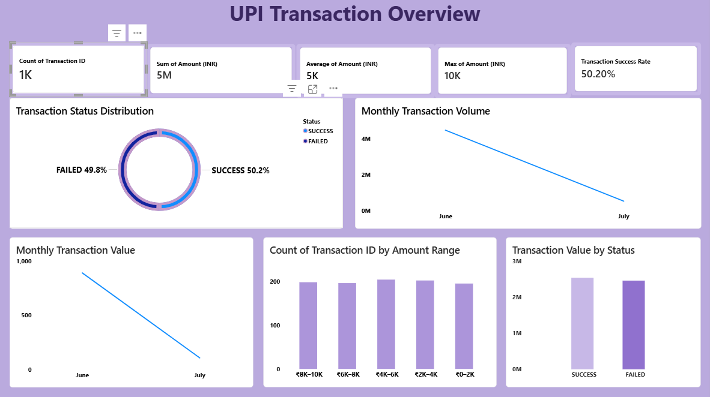
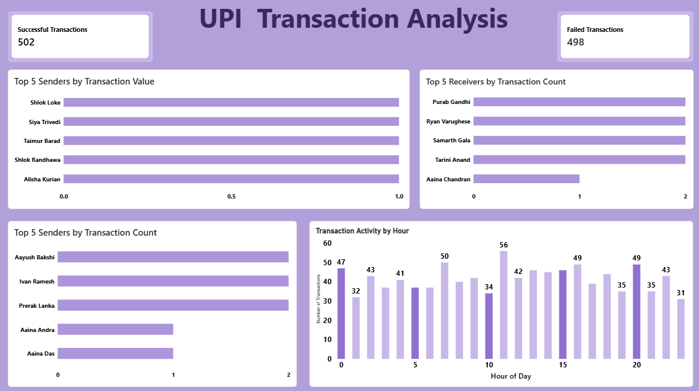

# UPI Transaction Analysis

## Project Overview
This project analyzes UPI transaction data to understand transaction
volume, transaction value, transaction success and failure patterns,
sender and receiver activity, and transaction trends.

The project uses Microsoft Excel for data preparation, MySQL for
SQL-based analysis, and Power BI for interactive data visualization.
---

## Project Objective
The main objective of this project is to analyze UPI transactions and
generate meaningful insights related to:

- Transaction volume
- Transaction value
- Successful and failed transactions
- Sender and receiver activity
- Monthly transaction trends
- Transaction activity by hour
- Transaction amount ranges
- High-value transactions
- Failed transaction patterns
---

## Tools & Technologies
- Microsoft Excel
- MySQL
- Power BI
---

## Project Structure
UPI-Transaction-Analysis/

├── README.md

├── SQL/
│   └── UPI_Transaction_Analysis.sql

├── Data/
│   └── Transaction_Cleaned.xlsx

└── PowerBI/
    ├── UPI_Transaction_Dashboard.pbix
    ├── Overview.png
    └── Summary.png

---

## Dataset
The dataset contains 1,000 UPI transactions with information such as:
- Transaction ID
- Timestamp
- Sender Name
- Sender UPI ID
- Receiver Name
- Receiver UPI ID
- Transaction Amount
- Transaction Status

Transaction status includes:
- SUCCESS
- FAILED
---

## SQL Analysis
MySQL was used to perform 20 transaction analysis queries.

The analysis includes:
1. Total number of transactions
2. Total transaction value
3. Average transaction amount
4. Highest transaction amount
5. Lowest transaction amount
6. Successful vs failed transactions
7. Total successful transaction value
8. Total failed transaction value
9. Average successful transaction amount
10. Top 5 senders by transaction value
11. Top 5 receivers by transaction value
12. Senders with total transaction value above ₹50,000
13. Transaction count by sender
14. Transaction count by receiver
15. Highest successful transaction
16. Top 3 successful senders by transaction value
17. Transactions by month
18. Monthly transaction value
19. Transactions above the overall average amount
20. Senders with the highest number of failed transactions
---

## Power BI Dashboard
An interactive Power BI dashboard was created with two pages.

### Page 1 – UPI Transaction Overview

The overview page contains:

- Total Transactions
- Total Transaction Amount
- Average Transaction Amount
- Maximum Transaction Amount
- Transaction Success Rate
- Transaction Status Distribution
- Monthly Transaction Volume
- Monthly Transaction Value
- Transaction Count by Amount Range
- Transaction Value by Status

### Page 2 – UPI Transaction Analysis

The analysis page contains:

- Successful Transactions
- Failed Transactions
- Top 5 Senders by Transaction Value
- Top 5 Receivers by Transaction Count
- Top 5 Senders by Transaction Count
- Transaction Activity by Hour
---

## Dashboard Preview

### Page 1 – UPI Transaction Overview

### Page 2 – UPI Transaction Analysis

---

## Key Findings
- The dataset contains 1,000 UPI transactions.
- 502 transactions were successful.
- 498 transactions were failed.
- The overall transaction success rate was approximately 50.2%.
- Transaction activity was analyzed across different months and hours.
- Sender and receiver transaction patterns were analyzed.
- Transaction amounts were analyzed using different amount ranges.
- High-value and failed transactions were identified.
---

## Team Contributions
This project was completed collaboratively.

### Devashish Johareya
- SQL analysis using MySQL
- Development of 20 SQL analysis queries
- Transaction analysis
- Power BI dashboard development
- Data visualization and business insights

### Payal Borse
- Data preparation and organization in Excel
- Data cleaning and validation
- Power BI dashboard development
- Business insights

Both team members contributed to the overall project development.
---

## Skills Demonstrated
- MySQL
- SQL
- Microsoft Excel
- Power BI
- Data Analysis
- Data Visualization
- Business Insight Generation
---

## Project Files
- [SQL Analysis](./UPI_Transaction_Analysis.sql)
- [Excel Dataset](./UPI_Transaction_Analysis.xlsx)
- [Power BI Dashboard](./UPI%20Transaction%20Analysis.pbix)

## Conclusion
This project demonstrates an end-to-end data analytics workflow,
starting with data preparation in Excel, followed by SQL-based analysis
using MySQL, and finally presenting the results through an interactive
two-page Power BI dashboard.

The project helped analyze UPI transaction patterns and convert
transaction data into meaningful business insights.
